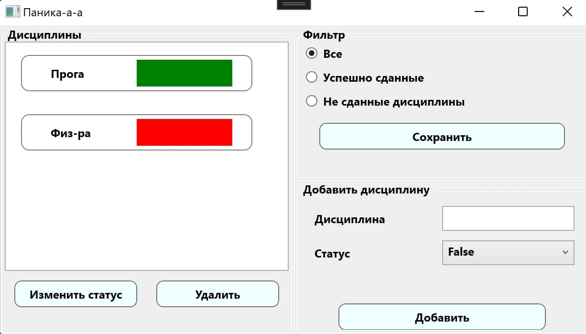
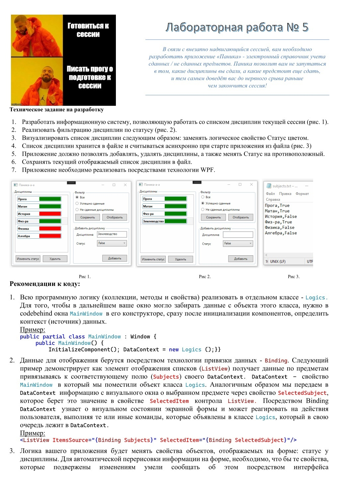
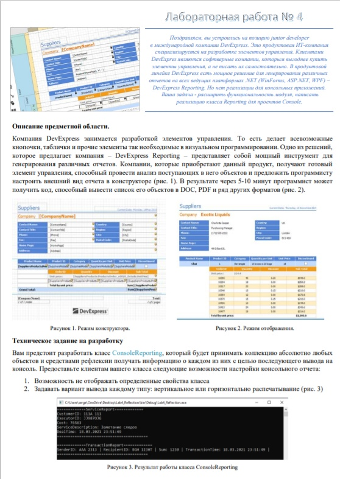
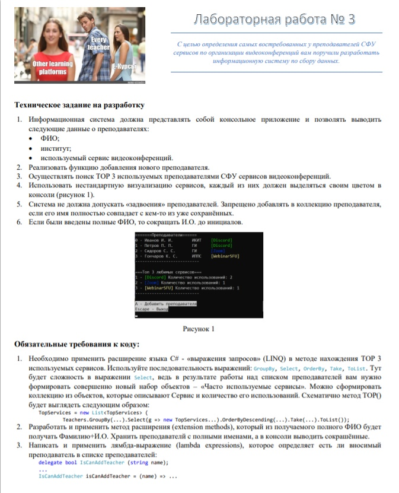
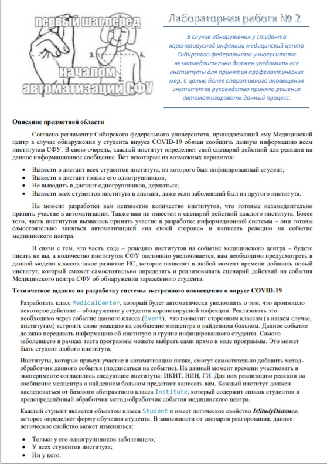
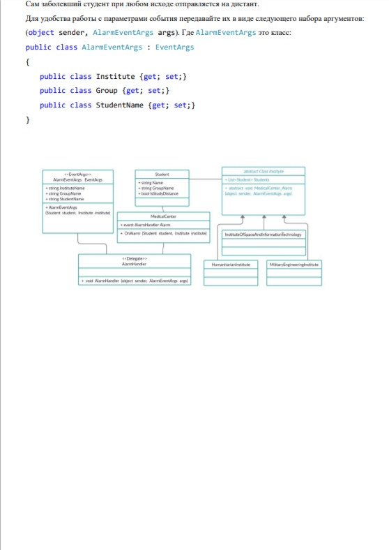
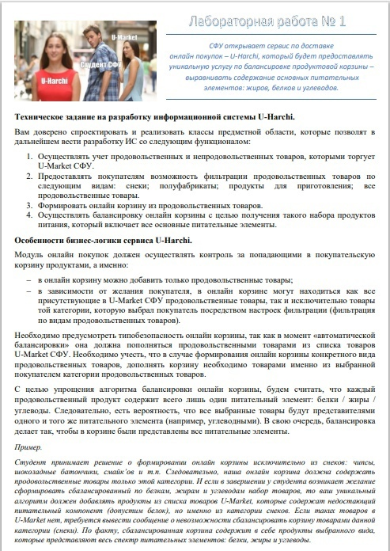
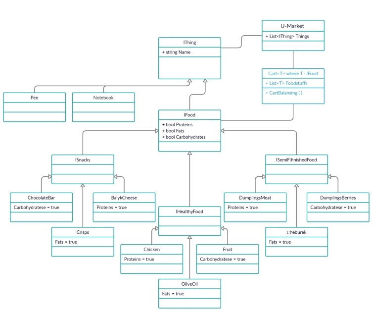

# C# - Лабораторные работы 
# Дисциплина: программирование

## Лабораторная №5
## **[Моя имплементация]()**

Затронутые темы:
+ Визуальное программирование
+ Асинхронное програмиирование
+ WPF
+ XAML
+ Фильтрация коллекций
+ Работа с файловой системой

ТЗ:  

## Лабораторная №4
## **[Моя имплементация](https://github.com/daniilboyarinkov/Labworks_2semester/tree/master/LabWork4)**

Затронутые темы:
+ Рефлексия
+ Аттрибуты

ТЗ:  

## Лабораторная №3
## **[Моя имплементация](https://github.com/daniilboyarinkov/Labworks_2semester/tree/master/LabWork3)**

Затронутые темы:
+ Методы расширений
+ LINQ
+ Lambda выражения
+ Анонимные методы

ТЗ:  

## Лабораторная №2 
## **[Моя имплементация](https://github.com/daniilboyarinkov/Labworks_2semester/tree/master/LabWork2)**

Затронутые темы:
+ Делегаты
+ События

ТЗ:  

## Лабораторная №1  
## **[Моя имплементация](https://github.com/daniilboyarinkov/Labworks_2semester/tree/master/LabWork1)**

Затронутые темы:
+ ООП
+ Наследование, ассоциация: композиция, агрегация
+ Абстрактные классы
+ Интерфейсы
+ Generics
+ Условный алгоритм сортировки

ТЗ:    

P.S. Я немного отклонился от требуемой реализации и сделал сортировку корзину на лету во время рантайма.

Хотя от нас требовалось захардкодить определенный тип и сортировать относительно него, чтобы а-ля понять как работают Дженерики.

Как по мне, если честно - это плохой пример для этого. У меня всё.
